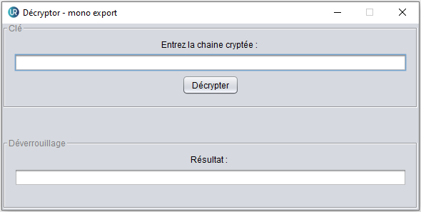

# Decryptor

Le projet comporte 2 modules distincts, une partie destinée aux utilisateurs (étudiants) et l’autre au client (université), 
le premier module sert principalement à ajouter un formulaire et ses fonctions sur une
page html contenue par un serveur existant où les étudiants réaliseront leurs devoirs en
distanciel afin de permettre le chiffrement de données sensibles, dont la note obtenue au
devoir. Le deuxième module sert quant à lui aux professeurs et a pour vocation de déchiffrer
les clés cryptées fournit par les étudiants sur Moodle par l’intermédiaire d’une application
Java.

# Architecture du module 

# Module de chiffrage Html js Node.Js CSS

# Module de déchiffrage Java
## Fenêtre principale 

## Mode de déchiffrage 

